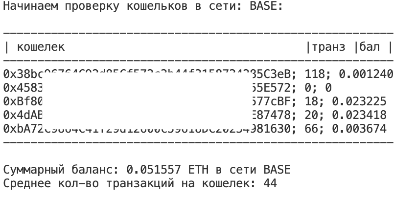

# EVM Wallet Checker & LayerZero Tx Checker

- не требует сторонних библиотек, кроме одной стандартной и наверняка уже установленной у тебя web3
- не требует приватников
- выводит в консоль кошелек, баланс нативного токена и количество транзакций
- эту информацию можно вставить в гугл таблицу либо Exel
- не требует api сторонних сервисов
- не требует прокси (для ZORA нужен европейский впн)
- сети: ETH, ZKSYNC, SCROLL, BASE, LINEA, ZKF, MANTA, ARBITRUM, OP, NOVA, ZORA, BSC, FTM, AVAXC, MATIC, CORE, CELO, METIS, HARMONY, GNOSIS
- проверяет количество транзакций в Л0 через официальный сканер https://layerzeroscan.com/
- позволяет выводить информацию с любым разделителем, по умолчанию ';'. Можно поставить люьой, например: ' | ' или ' ' или '-'
- одобрен ChatGPT-4 и Илоном Маском
- проверен Виталиком Бутериным
- создан сибилом для сибилов, по просьбе сибилов

#### В файл wallets.txt записываем адреса, не приватники!!!

> CHAIN = 'ETH'        # сеть, для ZORA нужен vpn в РФ и РБ
> 
> DELIMETR = '; '      # разделитель, можете использовать свой, например ' | ' или ' ' или '-'
> 
> SHOW_TOKEN = False   # если True то в конце суммы, на каждой стрке выводит валюту токена , наприме ETH или USDC

Если какой-то евм сети нет в списке, можете добавить ее самостоятельно в RPCS переменную. Данные можно взять на сайте https://chainlist.org/

#### Формат вывода в консоль:
> кошелек;транзакции;баланс

После вывода в консоль, информацию можно скопировать и вставить в гугл таблицы, где ее автоматически можно разбить на столбцы. Это стандартная функция таблиц.

Информация по обновлению скрипта в канале:            https://t.me/slow_rich

# L0 Tx Wallet Checker
Проверка количества транзакций в L0, через официальный сканер https://layerzeroscan.com/ :
Запускаем файл main_lz.py

- Не требует приватников
- Любое количество когельков
- Скрипт проверяет кошельки и выводт в консоль кошелек и количество транзакций в Л0.

Писал для себя с целью быстро видеть , на каких кошельках не хватает пары транзакций то кругой цифры: 25, 50, 100 транзакций.
Как я использую: копирую результат из консоли в гугл таблицу, где у меня настроено цветное форматирование ячеек. Там где кол-во транз < 25, ячейка красная, там где  > 50, ячейка зеленая, там где > 100 -  ячейка бирюзовая. Так визуально быстро видно , где не хватает до круглого числа.

И помни: 
#### Ты получишь мега иксы в 2024 году. Да, да, именно ты! https://t.me/slow_rich

